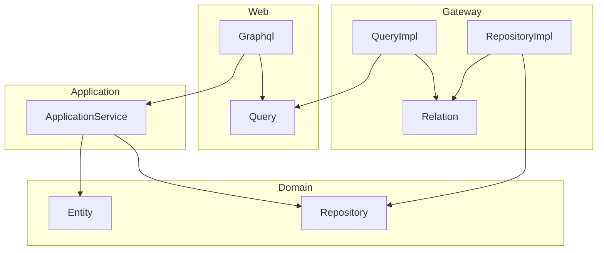

## 開発環境

### Prerequirements

- https://github.com/alexch/rerun

### Start server
```
docker compose up -d
./bin/dev
```

### Archtecture

```mermaid
flowchart TD
    subgraph Gateway
        RepositoryImpl-->Relation
        QueryImpl-->Relation
        Relation
    end

    subgraph Web
        Graphql
        Query
    end

    subgraph Application
        ApplicationService
    end

    subgraph Domain
        Entity
        Repository
    end

    RepositoryImpl-->Repository
    QueryImpl-->Query
    ApplicationService-->Entity
    ApplicationService-->Repository
    Graphql-->ApplicationService
    Graphql-->Query
```
